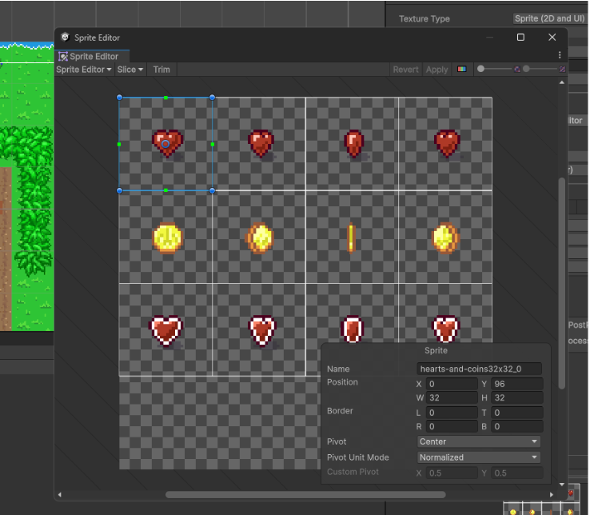
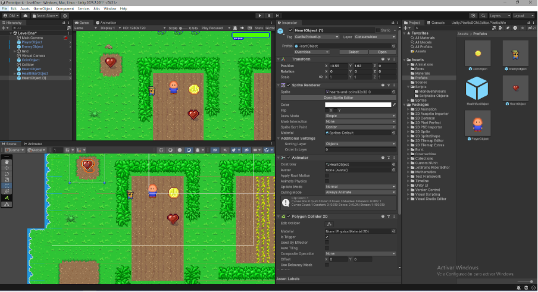
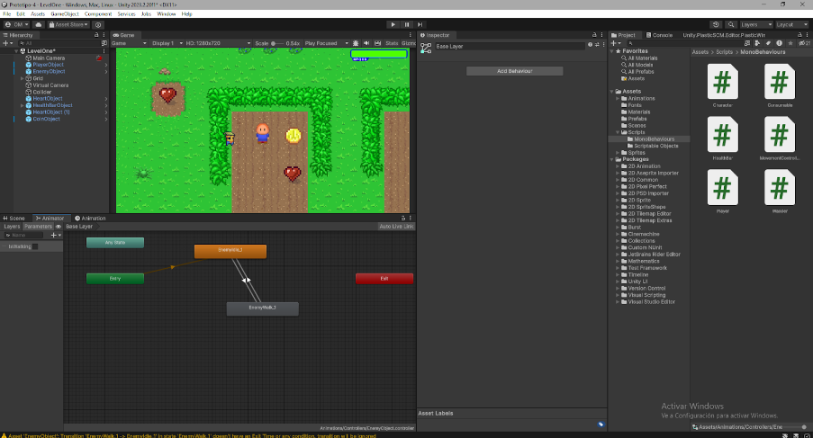

# Evidencia de la Materia Creación de Videojuegos ING

## Tabla de Contenidos

1. [Prototipo 1](#prototipo-1)
   - [Challenge 1](#challenge-1)
2. [Prototipo 2](#prototipo-2)
---

## Proyectos

### Prototipo 1
<details>
<summary>Detalles del Prototipo 1</summary>

- **Título:** Prototipo 1 - Juego de Carro 3D
- **Repositorio:** [Enlace al Prototipo 1](https://github.com/Creacion-De-Videojuegos-GIDS4102/Prototipo-1)
- ```bash
  git clone https://github.com/Creacion-De-Videojuegos-GIDS4102/Prototipo-1
  


</details>

### Challenge 1
<details>
<summary>Detalles del Challenge 1</summary>

- **Título:** Challenge 1 - Juego de Avion 3D
- **Repositorio:** [Enlace al Challenge 1](https://github.com/Creacion-De-Videojuegos-GIDS4102/Challenge-1)
- ```bash
  git clone https://github.com/Creacion-De-Videojuegos-GIDS4102/Challenge-1

</details>


### Prototipo 2
<details>
<summary>Detalles del Prototipo 2</summary>

- **Título:** Prototipo 2 - Juego de Granja 3D
- **Repositorio:** [Enlace al Prototipo 2](https://github.com/Creacion-De-Videojuegos-GIDS4102/Prototipo-2)
- ```bash
  git clone https://github.com/Creacion-De-Videojuegos-GIDS4102/Prototipo-2


</details>


### Challenge 2
<details>
<summary>Detalles del Challenge 2</summary>

- **Título:** Challenge 2 - Juego de Granja Mejorado 3D
- **Repositorio:** [Enlace al Challenge 2](https://github.com/Creacion-De-Videojuegos-GIDS4102/Challenge-2)
- ```bash
  git clone https://github.com/Creacion-De-Videojuegos-GIDS4102/Challenge-2


</details>

### Prototipo 3
<details>
<summary>Detalles del Prototipo 3</summary>

- **Título:** Prototipo 3 - Juego 2D
- **Repositorio:** [Enlace al Prototipo 3](https://github.com/Creacion-De-Videojuegos-GIDS4102/Prototipo-3)
- ```bash
  git clone https://github.com/Creacion-De-Videojuegos-GIDS4102/Prototipo-3


</details>

### Prototipo 4
<details>
<summary>Detalles del Prototipo 4</summary>

- **Título:** Prototipo 4 - Juego 2D
- **Repositorio:** [Enlace al Prototipo 4](https://github.com/Creacion-De-Videojuegos-GIDS4102/Prototipo-4)
- ```bash
  git clone https://github.com/Creacion-De-Videojuegos-GIDS4102/Prototipo-4





</details>

### Prototipo 5
<details>
<summary>Detalles del Prototipo 5</summary>

- **Título:** Prototipo 5 - Juego 2D
- **Repositorio:** [Enlace al Prototipo 5](https://github.com/Creacion-De-Videojuegos-GIDS4102/Prototipo-5)
- ```bash
  git clone https://github.com/Creacion-De-Videojuegos-GIDS4102/Prototipo-5







</details>